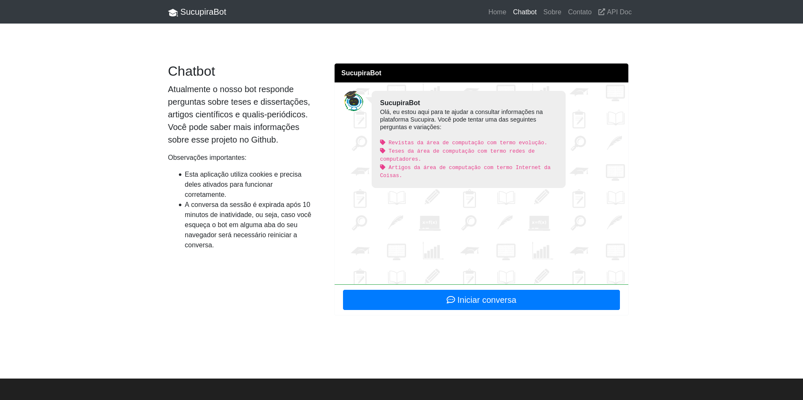
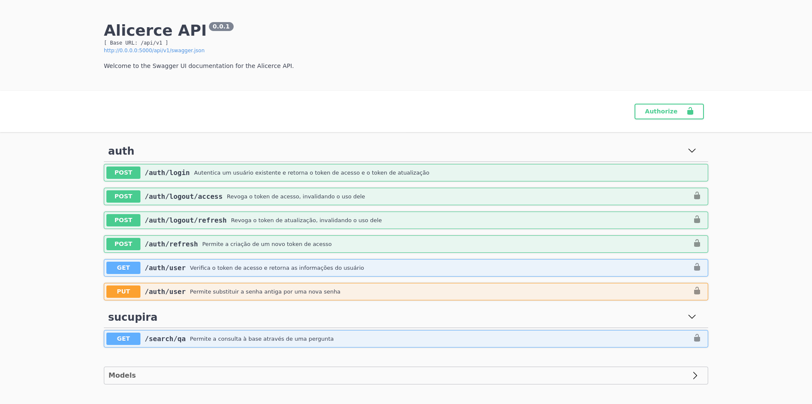

<p align="center"> 

<h1 align="center">
AlicerceAPI 🎓
</h1>

> A [**Plataforma Sucupira** ](https://sucupira.capes.gov.br/sucupira/)reúne informações sobre os programas de pós graduação do Brasil permitindo uma maior transparência para a comunidade a acadêmica brasileira. Essa plataforma tem como objetivo ser a base de referência do Sistema Nacional de Pós-Graduação (SNPG) [[1]](http://www.capes.gov.br/avaliacao/plataforma-sucupira). 

## 🤖 SucupiraBot

O **SucupiraBot** é uma ferramenta que foi construída com o objetivo de permitir consultar a [Plataforma Sucupira](https://sucupira.capes.gov.br/sucupira/) através de perguntas escritas na língua portuguesa, ou seja, através de linguagem natural. As informações utilizadas neste projeto foram extraídas do portal de [dados abertos da CAPES](dadosabertos.capes.gov.br/) e da Plataforma Sucupira. 



Abaixo listamos as informações presente na plataforma e quais estão incorporadas em nosso projeto:


- [x] Qualis
- [ ] Cursos avaliados e reconhecidos
- [ ] Dados Cadastrais do Programa
- [ ] Discentes
- [ ] Disciplinas
- [ ] Docentes
- [ ] Egressos
- [ ] Financiadores
- [ ] Linhas de Pesquisa
- [ ] Participantes Externos
- [ ] Disciplinas
- [ ] Pós-Doc
- [x] Produções Intelectuais *(parcial)*
- [ ] Projetos de Pesquisas
- [ ] Proposta do Programa
- [x] Trabalhos de Conclusão
- [ ] Turmas
- [ ] Fluxo de Discentes

## 📘 AlicerceAPI

Com o objetivo de facilitar a integração com outras API e sistemas, desenvolvemos uma API que nomeamos de **Alicerce API**. A nossa API é dividida em duas partes, a parte de autenticação e a parte da consulta, conforme ilustramos na Figura abaixo.




Utilizamos [*Json Web Tokens*](https://jwt.io/) para autenticação da nossa API. A partir do nome de usuário (*username*) e senha (*password*) informados na rota `/auth/login` fornecemos dois *tokens*, sendo eles o Token de Acesso (*Access Token*) e o Token de Atualização (*Refresh Token*). Eles possuem um tempo de validade informado na Tabela a seguir:


<center>

|   Tokens     |Tempo de duração|
|--------------|----------------|
| Access Token |   30 minutos   |
| Refresh Token|   15 dias      |

</center>

Caso o *Access Token* expire, você pode solicitar outro na rota `/auth/refresh` informando o *Refresh Token*. Se ambos os *tokens* expirarem, você pode solicitar novos *tokens* na rota de *login*. Para atualizar a senha do seu usuário, você deve informar a senha antiga e a nova na rota `/auth/user` usando o verbo **PUT**. 

> Obs: Para usar as rotas protegidas é necessário informa o *token* no campo *Authorization* no *header* da requisição no formato `Bearer TOKEN`.

### ⚙️ Configurando a API

Para instalar as dependências, utilize o `poetry install` na raiz do projeto. Em seguida execute o comando `make init_db` para criar o banco de dados.

Crie um usuário administrador, no comando a seguir criamos o usuário **admin** com senha **1234**. 

```sh
$ flask add-user -usr admin -pwd 1234 -admin
```

Execute a aplicação através do comando:

```sh
$ make run
``` 

### 📚 Utilizando

Para demonstrar o uso da API decidimos mostrar seu uso via python, você pode fazer essa operação via qualquer linguagem suportada.


```python
import requests
import os

api_endpoint = os.getenv("API_URL")
headers = {'User-Agent': 'Mozilla/5.0'}

# Passar nome de usuário e senha
payload = {'username':'usuario','password':'senha'}
# Acessar a rota de login
login_route = os.path.join(api_endpoint, "auth/login")
response = requests.post(login_route,headers=headers,data=payload)

if response.status == 200:
    json = response.json()

    # Obter lista de tokens para acessar os demais endpoints
    access_token = json["access_token"]
    refresh_token = json["refresh_token"]

    # Inserir o Token de acesso no header, para acessar os endpoints onde ele é exigido
    headers["Authorization"] = 'Bearer ' + access_token
    

    # Realizar consulta no endpoint /search/qa
    search_route = os.path.join(api_endpoint, "search/qa")
    # Informar a pergunta escrita em linguagem natural.
    query_data = {
            "q": "Quais as revistas de computação sobre inteligência com conceito A1?"
    }
    response = requests.get(search_route, data=query_data,headers=headers)
    # Abaixo mostramos os resultados retornados para a pergunta acima.
    """
    >>> response.json()
    {
        'status': 'success',
        'message': 'Successful search',
        'answer':
        {
            'text': 'Estas são as revistas de computação com o termo inteligência com conceito A1:',
            'results': [
                {
                    'ISSN': '0004-3702',
                    'Título': 'ARTIFICIAL INTELLIGENCE (GENERAL ED.)'
                },
                {
                    'ISSN': '0162-8828',
                    'Título': 'IEEE TRANSACTIONS ON PATTERN ANALYSIS AND MACHINE INTELLIGENCE'
                },
                {
                    'ISSN': '1076-9757',
                    'Título': 'THE JOURNAL OF ARTIFICIAL INTELLIGENCE RESEARCH (PRINT)'
                }
            ], 
            'event': 'CLASSIFICAÇÕES DE PERIÓDICOS QUADRIÊNIO 2013-2016'}
        }
    """
```

<!-- ## 🤖 Chatbot

Desenvolvemos também uma versão web para permitir consultas via interface de *chatbot*, ela se encontra disponível no endereço www.sucupirabot.com. -->